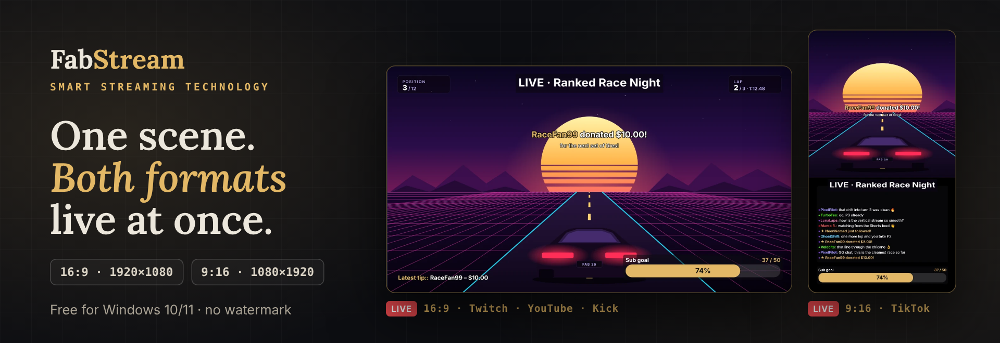
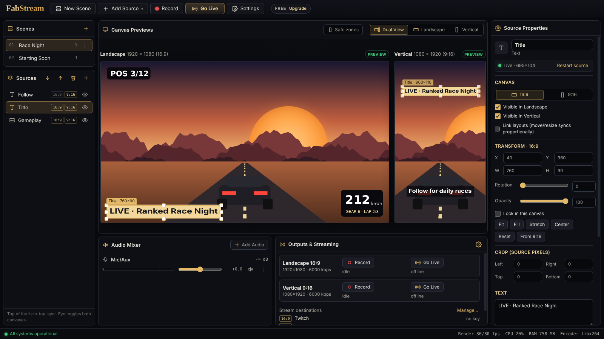
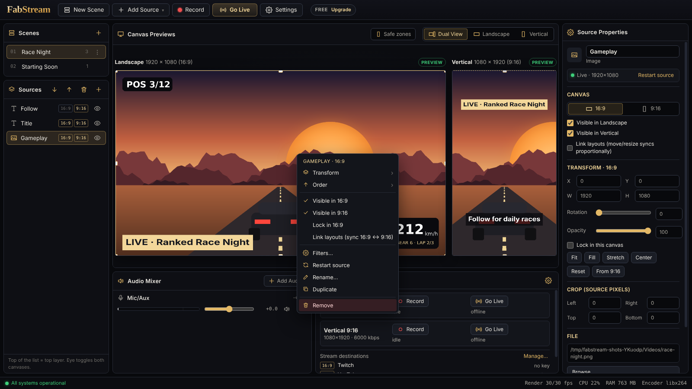

<!-- fabstream-page -->
<p align="center">
  
</p>

<p align="center">
  <a href="https://github.com/FabcomDev/FabStream/releases/latest/download/FabStream-Setup.exe"></a>
  <a href="https://fabstream.fabcomstudios.com"></a>
</p>

<p align="center">
  <a href="https://github.com/FabcomDev/FabStream/releases/latest"></a>
  <a href="https://github.com/FabcomDev/FabStream/releases"></a>
  
  
  
</p>

<h3 align="center">One scene. Both formats. Live at the same time.</h3>

<p align="center">
  FabStream is a streaming studio for Windows that sends <b>landscape (16:9)</b> to Twitch, YouTube and Kick<br>
  and <b>vertical (9:16)</b> to TikTok LIVE and Shorts <b>at the same time</b> – each format with its own layout.<br>
  Game capture, alerts, chat, a chat bot, sound presets and replay clips are built in. No plugins, no second PC.
</p>

<p align="center">
  <a href="#-new-in-35">New</a> ·
  <a href="#-everything-in-one-app">Features</a> ·
  <a href="#-screenshots">Screenshots</a> ·
  <a href="#-platforms">Platforms</a> ·
  <a href="#-performance">Performance</a> ·
  <a href="#-plans">Plans</a> ·
  <a href="#%EF%B8%8F-install">Install</a> ·
  <a href="#-faq">FAQ</a> ·
  <a href="#-deutsch">Deutsch</a> ·
  <a href="CHANGELOG.md">Changelog</a>
</p>

<p align="center"><sub>Platform availability and RTMP access (for example a TikTok LIVE stream key) depend on your account and each platform's eligibility requirements.</sub></p>

---

## 🆕 New in 3.5

- **Game Capture** – *Capture any game automatically*: FabStream finds the game you play (Steam, Epic, Riot, Xbox, GOG, Ubisoft, EA, Rockstar, Unity/Unreal games …), follows you through Alt+Tab and never grabs your browser or Discord. Nothing is injected into the game – anti-cheat safe.
- **Scene presets** – *Starting soon*, *Gaming*, *Just Chatting*, *Be right back* and *Ending*, laid out for 16:9 **and** 9:16 in one click.
- **Settings → Assistant** – measures upload, download, ping and your PC, rates every quality for your platforms and sets the best one for both formats.
- **Go Live shows what is missing** – every platform says *Ready*, *No stream key*, *Account problem* or *Plan limit*, with the one-click fix.
- **Game & sound presets** – *Cinematic*, *3D Surround*, *Competitive – Footsteps* … for game audio, made to leave room for your voice.
- **Stream tags** for Twitch, Kick and YouTube, **TikTok LIVE chat & gifts** *(Beta)*, **background music** from your own playlist and a guided **app tour** in English, German and Italian.

All changes: [Changelog](CHANGELOG.md).

## ✨ Everything in one app

| | |
|---|---|
| 🖥️📱 **True dual output** | Two independent canvases. Place camera, chat and overlays differently in 16:9 and 9:16; both go live with one click. Safe zones for TikTok, Shorts and Reels with snapping. |
| 🎮 **Game Capture** | Automatic game detection or a chosen game window, found again after a restart. Plus display, window, webcam, images, video, text and browser sources. |
| 📡 **Multistream & Go Live** | Each format to its own platforms – up to 8 per format. The Go Live picker shows which platform is ready and fixes the rest in one click; platforms can be added or removed while you are live, and a dropped one reconnects on its own. |
| 🔗 **Connected platforms** | Connect Twitch, Kick and YouTube once: FabStream fetches your stream key and sets title, category and tags – no copying of keys. |
| 💬 **Chat, viewers & activity** | Twitch, Kick and TikTok LIVE *(Beta)* chat in one place, YouTube live chat, viewers per channel and in total, write to Twitch and Kick from the app. |
| 🔔 **Alerts & widgets** | Alert box, chat box, event list, goal bar, latest/top labels, timer and *Now playing* – drawn by FabStream itself, with your own sounds and pictures. Donations and Super Chats via StreamElements, text-to-speech. |
| 🤖 **FabBot** | Chat polls and giveaways with on-stream widgets, commands, timed messages and mod tools for Twitch and Kick. |
| 🎙️ **Voice presets** | *Deep Podcast*, *Broadcast Radio*, *Clear Streamer* … – optionally tuned to your voice, your room and your microphone after a short voice analysis. |
| 🎧 **Game & sound presets** | *Cinematic*, *3D Surround*, *Competitive – Footsteps*, *Story & Dialogue*, *Punchy Arcade*, *Background Bed* – each leaves a "voice pocket" so you are always understood over the game. |
| 🎵 **Audio mixer** | Microphones, desktop audio, single applications (Discord, Spotify, a game) as their own channels, background music from your own playlist, monitoring and filters. |
| ⏪ **Replay buffer & clips** | One click saves the last moments as 16:9 **and** 9:16 MP4 – instantly, no re-encoding. |
| ✂️ **Auto-Cutter** | Its own tab next to the Studio, with all your recordings and clips to browse. FabStream finds the highlights of your recording, shows them on a timeline under a 16:9 and a 9:16 preview, you adjust them – one click cuts every clip in both formats and shares them with title, description and hashtags to YouTube Shorts and TikTok. |
| 🎬 **Transitions & studio mode** | Fade, slide, swipe, wipe and stinger videos; prepare the next scene while the current one stays live. |
| ⚡ **One encoder per format** | Streaming, recording and the replay buffer of a format share one hardware encoder (NVIDIA NVENC, AMD AMF, Intel Quick Sync, automatic x264 fallback) – **2 encoder sessions** for everything. |
| 🧭 **Assistant & self-healing** | The Assistant picks the settings your PC and upload can carry; a crashed encoder restarts on its own and the Outputs panel warns early about dropped frames or a slow upload. |
| 🔒 **Private by design** | Stream keys and tokens are stored encrypted on your PC (Windows DPAPI). No account needed for the free version. Signed updates. |

## 📸 Screenshots

<p align="center">
  
</p>
<p align="center"><sub>One scene, two layouts: 16:9 and 9:16 side by side, with alerts, goal bar and the combined chat of Twitch, Kick and YouTube.</sub></p>

<p align="center">
  
</p>
<p align="center"><sub>Go Live with the state of every platform, scene presets, voice &amp; game presets, built-in alerts and widgets, FabBot.</sub></p>

## 🧭 How it works

1. **Build your scene once** – add Game Capture, webcam, alerts, chat and audio, or start from a scene preset.
2. **Lay it out twice** – arrange the 16:9 canvas for Twitch/YouTube/Kick and the 9:16 canvas for TikTok/Shorts. Sources can share a position or have their own per format.
3. **Go live** – pick your platforms, and each format streams to its own destinations, records locally and keeps a replay buffer. Save a clip at any moment and get both formats instantly.

<details>
<summary><b>⌨️ Keyboard shortcuts</b></summary>

| Keys | Action |
|---|---|
| <kbd>Esc</kbd> | Back: close the dialog or menu, otherwise deselect |
| <kbd>Enter</kbd> | Accept the dialog (OK, Save, Delete …) |
| <kbd>Ctrl</kbd>+<kbd>Z</kbd> / <kbd>Ctrl</kbd>+<kbd>Y</kbd> | Undo / redo |
| <kbd>Ctrl</kbd>+<kbd>1</kbd> … <kbd>9</kbd> | Switch to scene 1 … 9 |
| <kbd>Ctrl</kbd>+<kbd>,</kbd> | Settings |
| <kbd>Ctrl</kbd>+<kbd>Shift</kbd>+<kbd>L</kbd> / <kbd>Ctrl</kbd>+<kbd>Shift</kbd>+<kbd>R</kbd> | Go live / record |
| <kbd>Delete</kbd> | Delete the selected scene or remove the selected source |
| <kbd>F2</kbd> | Rename the selected scene or source |
| Arrow keys | Move the source 1 px (with <kbd>Shift</kbd> 10 px) |
| <kbd>Ctrl</kbd>+click | Select several sources and move, align or resize them together |
| <kbd>F1</kbd> | Show all shortcuts in the app |

Global hotkeys for going live, recording and saving clips work while you are in a game – set them in **Settings → Hotkeys**.
</details>

## 📡 Platforms

Each format streams to its own list of destinations – for example 16:9 to Twitch, YouTube and Kick, 9:16 to TikTok LIVE.

| Platform | How to connect |
|---|---|
| **Twitch** | connect your account – stream key, title, category and tags are set from FabStream |
| **YouTube** | connect your Google account – stream key, title, category, tags and live chat |
| **Kick** | connect your account – stream key, title, category and tags |
| **TikTok LIVE** | *Add platform* picks up server and key from TikTok LIVE Producer\* |
| **Instagram**, **Facebook** | *Add platform* picks up the RTMP(S) server and key the platform shows you\* |
| **Any other service** | every RTMP / RTMPS server (Restream, your own server, …) |

<sub>\* Platforms decide who gets a stream key; requirements (for example a minimum follower count for TikTok LIVE) vary by account and region.</sub>

## 🚀 Performance

Measured with FabStream's built-in benchmark on a Ryzen 7 7800X3D + GeForce RTX 5070 Ti (NVENC), 1080p60 in **both** formats at the same time:

| Scenario | Outputs | Encoder sessions | Render | Encoder speed | Dropped frames |
|---|:---:|:---:|:---:|:---:|:---:|
| Stream + recording, 16:9 + 9:16 | 4 | 2 | 60 fps | ≥ 1.01× | 0 |
| + replay buffer in both formats | 6 | 2 | 60 fps | ≥ 1.01× | 0 |

Compositing both canvases took about 0.2 ms per frame. Results on other hardware differ – **Settings → Assistant** shows what your PC and connection can carry, and the Outputs panel shows encoder speed and dropped frames live.

## 💎 Plans

| | **Free** | **Premium** | **Ultra** | **Max** |
|---|:---:|:---:|:---:|:---:|
| 16:9 + 9:16 at the same time | ✅ | ✅ | ✅ | ✅ |
| Scenes, Game Capture, widgets, FabBot, presets, recording | ✅ | ✅ | ✅ | ✅ |
| Platforms per format (multistream) | 1 | 3 | **8** | **8** |
| Output resolution / frame rate | 1080p / 60 fps | 1440p / 120 fps | **4K / 240 fps** | **4K / 240 fps** |
| Replay buffer & instant clips | 2 min | 5 min | 10 min | **30 min** |
| Watermark / time limit | **none** | **none** | **none** | **none** |
| PCs per license | – | 1 | 3 | **5** |
| Auto-Cutter: find & edit highlights | ✅ | ✅ | ✅ | ✅ |
| Auto-Cutter: cut clips in 16:9 + 9:16 | – | ✅ | ✅ | ✅ |
| Share clips to YouTube & TikTok from the app | – | – | ✅ | ✅ |
| Early access to preview features | – | – | – | ✅ |
| Price per month | **$0** | **$7.99** | **$14.99** | **$24.99** |
| Price per year | – | $59 | $109 | $179 |

Try **every feature 7 days for free** inside the app (no credit card). Plans are bought on the [FabStream website](https://fabstream.fabcomstudios.com) (€ prices in German) – sales are opening soon. A plan belongs to your FabStream account and works on as many PCs as it includes.

## ⬇️ Install

1. **[Download `FabStream-Setup.exe`](https://github.com/FabcomDev/FabStream/releases/latest/download/FabStream-Setup.exe)** (Windows 10/11, 64-bit).
2. Run it and choose your language (English, Deutsch, Italiano). If Windows SmartScreen shows *"Windows protected your PC"*: click **More info → Run anyway**.<br>
   <sub>FabStream is new and not yet known to SmartScreen; this message disappears as more people use it.</sub>
3. A short app tour shows you around; **Settings → Assistant** picks the best settings for your PC and upload.

FabStream checks for updates on every start. **Update & restart** downloads the new version, verifies its signature and checksum and installs it – your scenes and settings are kept, and *What's new* shows the changes.

| Requirements | |
|---|---|
| System | Windows 10 or 11 (64-bit) |
| Memory | 8 GB RAM (16 GB recommended for 1440p/4K) |
| Graphics | a GPU with H.264 hardware encoding recommended (NVIDIA GTX 10-series or newer, AMD RX 400 or newer, Intel 6th gen or newer) |
| Upload | ≈ 6 Mbit/s per destination at 1080p60 |

## ❓ FAQ

<details>
<summary><b>Is the free version really free?</b></summary>

Yes. Both formats at once up to 1080p60, Game Capture, widgets and alerts, FabBot, voice and game presets, recording, replay clips and all filters are free – with no watermark and no time limit. Finding and editing highlights in the Auto-Cutter is free too. Premium, Ultra and Max add multistream (3 or 8 platforms per format), 1440p or 4K, up to 120 or 240 fps, longer replay buffers and more PCs – Premium cuts Auto-Cutter clips, Ultra also shares clips to YouTube Shorts and TikTok from the app.
</details>

<details>
<summary><b>Can FabStream replace OBS or Streamlabs?</b></summary>

For most streamers, yes: scenes, Game Capture, browser sources, transitions with stingers, studio mode, alerts and widgets, chat, a chat bot, multistream and replay clips are built in – plus landscape and vertical at the same time, which neither offers without workarounds. Workflows that depend on OBS plugins, scripting or a virtual camera may still need OBS.
</details>

<details>
<summary><b>Do I need a powerful PC for two formats?</b></summary>

Less than you might think: each format has exactly one encoder, no matter how many platforms you stream to, and the encoding runs on the graphics card. A current mid-range GPU handles both formats at 1080p60 with streaming, recording and the replay buffer. **Settings → Assistant** measures your PC and upload and tells you which quality fits.
</details>

<details>
<summary><b>Does Game Capture work with anti-cheat?</b></summary>

Yes. FabStream does not inject anything into the game – it captures the game window. Games in exclusive fullscreen may show black; switch them to borderless or windowed fullscreen.
</details>

<details>
<summary><b>Can I stream vertical to TikTok and landscape to Twitch at the same time?</b></summary>

Yes – that is what FabStream is built for. Each format has its own layout and its own destinations, and both go live with one click. You need a TikTok LIVE stream key (see <a href="#-platforms">Platforms</a>).
</details>

<details>
<summary><b>Can I record Discord or music separately – or not at all?</b></summary>

Yes. Audio Mixer → Add Audio → <b>Application Audio</b> records one program as its own channel with its own volume; in the desktop audio you can leave a program out completely. <b>Background music</b> plays your own playlist into the stream.
</details>

<details>
<summary><b>Can I use FabStream only for recording, without streaming?</b></summary>

Yes. Record both formats as MP4 (or only one), keep a replay buffer, save and cut clips – no platform account needed.
</details>

<details>
<summary><b>Is my stream key safe?</b></summary>

Stream keys never leave your PC except to the platform you stream to. They are stored encrypted with Windows DPAPI; connected accounts fetch the key straight from the platform.
</details>

## 🔐 Verify your download

Every release lists the **SHA-256** checksum of `FabStream-Setup.exe` in its release notes and in `SHA256SUMS.txt` (signed: `SHA256SUMS.txt.sig`, see [SECURITY.md](SECURITY.md)). To check the file you downloaded, open PowerShell in your Downloads folder:

```powershell
Get-FileHash .\FabStream-Setup.exe -Algorithm SHA256
```

The hash must match the one in the [release notes](https://github.com/FabcomDev/FabStream/releases/latest).

## 📄 Documents

[Changelog](CHANGELOG.md) · [Security](SECURITY.md) · [Privacy policy](PRIVACY.md) · [End-user license (EULA)](EULA.md) · [Third-party licenses](THIRD_PARTY_NOTICES.md)

## 🇩🇪 Deutsch

<details>
<summary><b>FabStream auf Deutsch – kurz erklärt</b></summary>

FabStream ist ein Streaming-Studio für Windows, das **16:9 und 9:16 gleichzeitig** live sendet und aufnimmt – z. B. querformatig auf Twitch, YouTube und Kick und hochformatig auf TikTok LIVE, mit eigenem Layout pro Format. Die App gibt es auf Deutsch, Englisch und Italienisch.

- **Alles eingebaut:** Game Capture (erkennt dein Spiel automatisch), Szenen-Vorlagen, Alerts und Widgets, Chat von Twitch, Kick und TikTok, FabBot (Umfragen, Gewinnspiele, Befehle), Voice- und Game-Presets, Hintergrundmusik, Replay-Clips in beiden Formaten.
- **Go Live:** zeigt pro Plattform, ob sie bereit ist – fehlt ein Stream-Key oder ein Konto, behebst du es mit einem Klick. Titel, Kategorie und Tags für Twitch, Kick und YouTube direkt aus FabStream.
- **Auto-Cutter:** findet die Highlights deiner Aufnahme, zeigt sie auf einer Zeitleiste unter einer 16:9- und einer 9:16-Vorschau – verschieben, Cut drücken, und alle Clips in beiden Formaten gehen mit Titel, Beschreibung und Hashtags an YouTube Shorts und TikTok (Schneiden ab Premium, Teilen ab Ultra).
- **Einstellungen → Assistent:** misst Upload, Download, Ping und deinen PC und stellt die beste Qualität für beide Formate ein.
- **Kostenlos:** beide Formate gleichzeitig bis 1080p60, alle Funktionen oben, Aufnahme, 2 Minuten Replay-Puffer – **ohne Wasserzeichen, ohne Zeitlimit**.
- **Premium (7,99 € / Monat · 59 € / Jahr):** 3 Plattformen pro Format, Auto-Cutter-Clips schneiden, bis 1440p und 120 fps, 5 Minuten Replay, 1 PC.
- **Ultra (14,99 € / Monat · 109 € / Jahr):** 8 Plattformen pro Format, Clips direkt auf YouTube & TikTok teilen, bis 4K und 240 fps, 10 Minuten Replay, 3 PCs.
- **Max (24,99 € / Monat · 179 € / Jahr):** alles aus Ultra, 30 Minuten Replay, 5 PCs, früher Zugang zu neuen Funktionen.
- Alle Funktionen 7 Tage gratis testen, ohne Kreditkarte.
- **Installation:** [`FabStream-Setup.exe` herunterladen](https://github.com/FabcomDev/FabStream/releases/latest/download/FabStream-Setup.exe) und starten. Zeigt Windows SmartScreen *„Der Computer wurde durch Windows geschützt"*: **Weitere Informationen → Trotzdem ausführen**.

Pläne, Konto und Lizenz: [Website](https://fabstream.fabcomstudios.com) (auch auf Deutsch und Italienisch).
</details>

## 💬 Support

Bugs, ideas and questions: open an [issue](https://github.com/FabcomDev/FabStream/issues), or use **Report a bug / Suggest an idea** in FabStream's settings. Plan and license questions: [website](https://fabstream.fabcomstudios.com).

---

<p align="center">
  <sub><b>FabStream</b> is a project by <b>Fabcom</b>.<br>
  This repository hosts the official Windows downloads. FabStream is proprietary software (EULA shown during installation).<br>
  Third-party components (Electron – MIT, FFmpeg – GPL v3) are listed in <code>THIRD_PARTY_NOTICES.md</code> in the installation folder.<br>
  Twitch, YouTube, TikTok, Kick, Instagram and Facebook are trademarks of their respective owners; FabStream is not affiliated with them.</sub>
</p>
